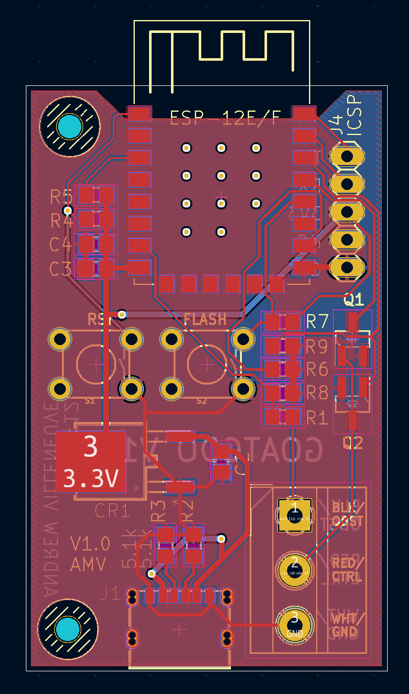
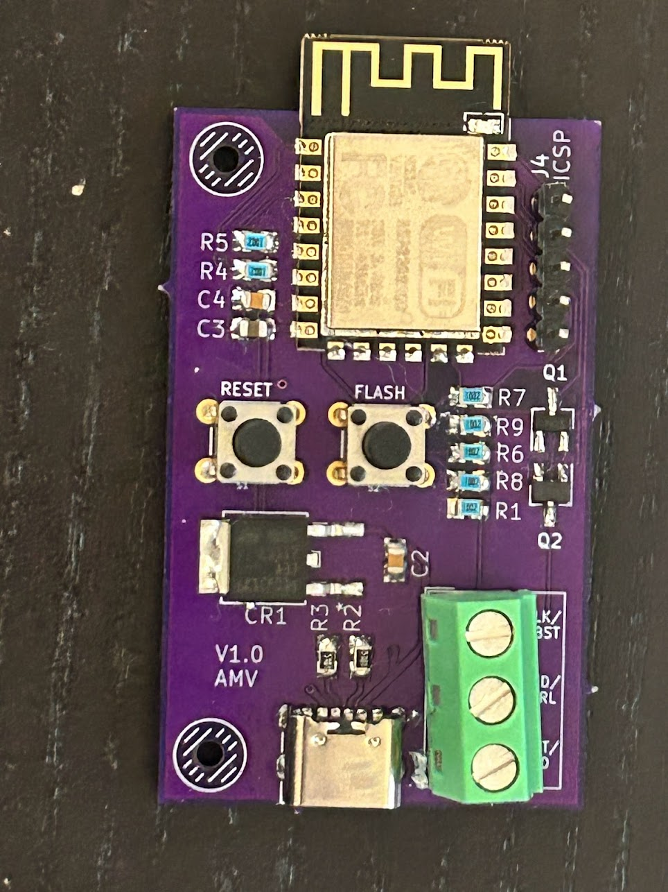

# ESP8266 12-F USB-C KiCad files

A reworking of the Bare ESP8266 board design that uses USB-C for power instead of an LM2596 submodule, and uses just one GDO connector header to allow for a smaller board footprint.

Compatable with RatGDO ESPHome software for the v2.5 official board.

## Populating

Populating the Flash switch, Reset switch, and ICSP header are optional, but will make first time programming easier.

## Powering 

This board uses a 6-pin power-only USB-C jack that can be either hand soldered or paste reflowed. It's a normal 5V USB sink device, so any "dumb" USB wall-wart can be used.

It can also be powered via the 3.3V pin of the ICSP header - there's no need to connect USB while serial programming it.

If you wish to power the device directly from the programming header using 3.3V, you can skip populating the USB-C port, resistors R2 and R3, and the LDO regulator CR1, but you should ensure you're using a stable and regulated 3.3V supply.

If your GDO has battery backup system, I'd recommend using one of the LM2996 module based boards in this repository instead of this one.

## Programming

The USB-C port on this board is for power only - you need to use the ICSP programming header with a seperate TTL-level RS232 programming interface to load the initial firmware.

The ICSP header will mate directly with the 
[SparkFun Serial Basic Breakout](https://www.sparkfun.com/products/14050) for programming, but any 3.3V RS232 interface can be used by connecting TX, RX, VCC and GND appropriately.

Auto reset via serial hardware control lines isn't supported - you'll need to press the Reset button manually after programming, or power cycle the device.

